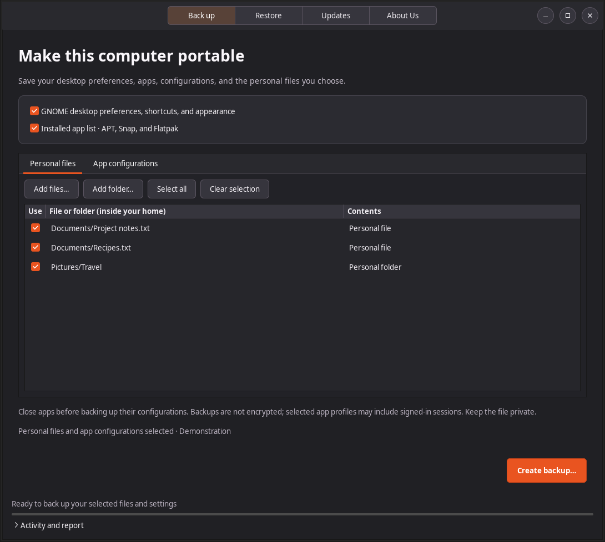
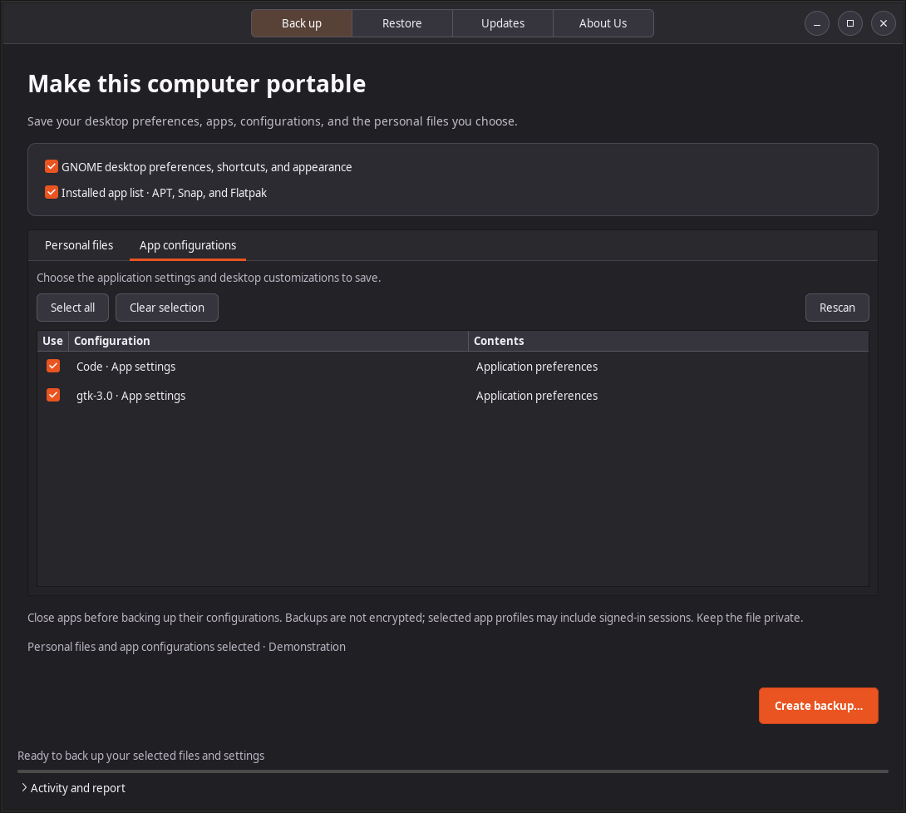
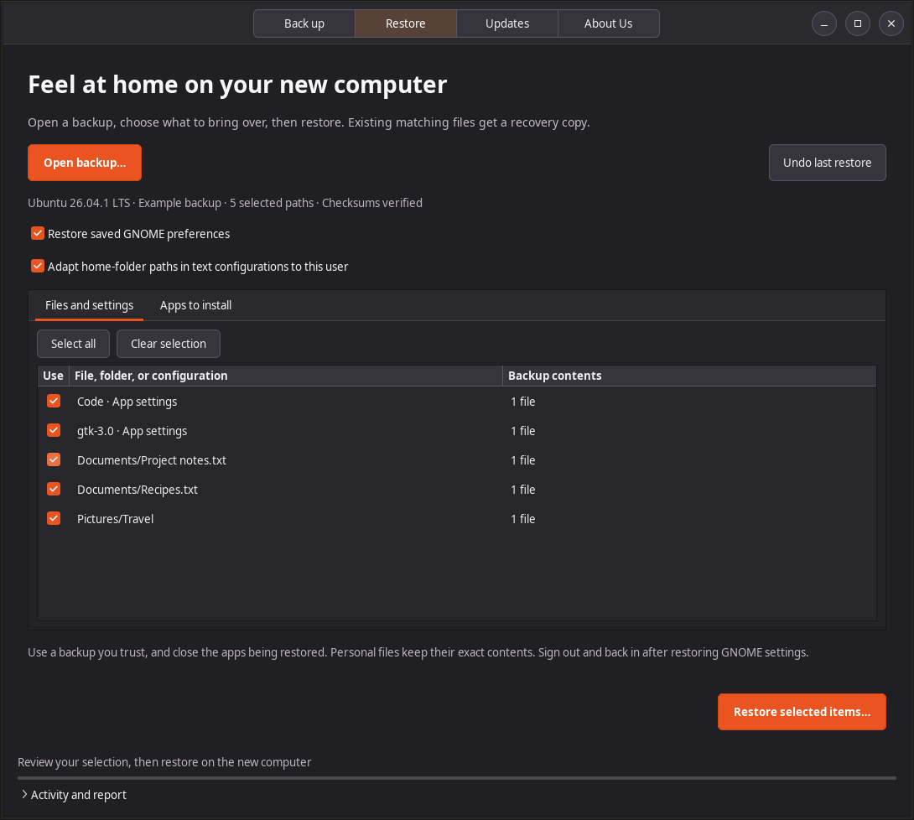
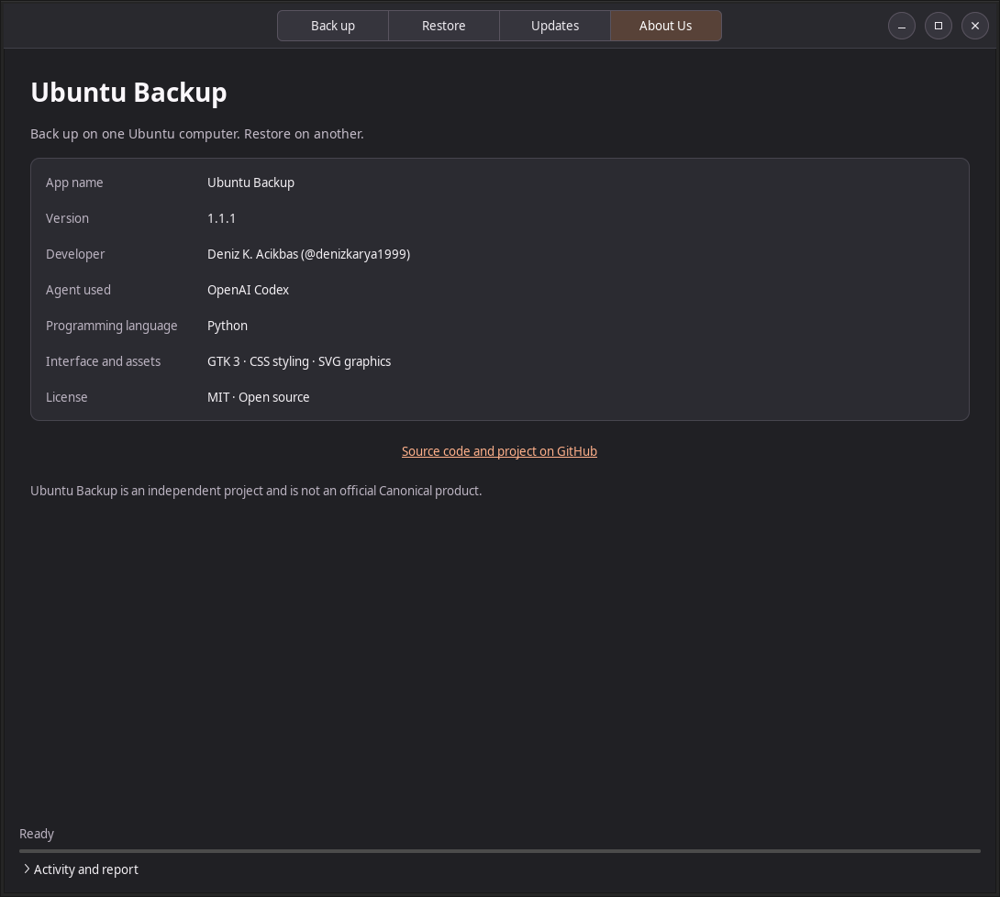

# Ubuntu Backup

A native Linux desktop app to back up an Ubuntu computer and restore selected
content on another Ubuntu Desktop computer.

## Screenshots

Real application screens using demonstration files, captured with version 1.1.1.

| Back up | App configurations |
| --- | --- |
|  |  |
| Restore | About Us |
|  |  |

[View all full-size screenshots, including Updates](docs/screenshots/).

## Install

Download `ubuntu-backup_1.1.1_all.deb` from
[GitHub Releases](https://github.com/denizkarya1999/ubuntu-backup/releases/latest).
Open the downloaded package with your software installer, or run:

```sh
sudo apt install ./ubuntu-backup_1.1.1_all.deb
```

Launch **Ubuntu Backup** from the applications menu. Run it as your normal user.
Administrator authentication is requested only for software installation.

Designed for Ubuntu Desktop 22.04 and newer. The package uses the distribution's
Python, GTK 3, dconf, APT, Snap, Flatpak, and PolicyKit. The same Ubuntu release
on both computers is recommended. Internet is needed for app installation and
app updates, but not for backing up or restoring files.

## From the old computer to the new one

1. Open **Back up** on the old computer. Choose GNOME preferences and the app list.
2. Review the **App configurations** tab. In **Personal files**, use **Add files** or **Add folder** to select
   personal content inside your home folder. Nothing in Documents, Pictures,
   Downloads, or other personal folders is included unless you select it.
3. Close affected applications, then choose **Create backup**. Save the `.ubackup`
   file to an external drive or another location with enough space.
4. Copy that file to the new computer and install Ubuntu Backup there.
5. Open **Restore → Open backup**. Review **Files and settings** and **Apps to install**.
   You can deselect any saved path or app. Only checked items are restored.
6. Choose **Restore selected items**. After restoring GNOME preferences, sign out
   and sign back in. Open restored applications and check their settings.

The interface uses a dark theme, including the file pickers and activity report.
Dot-prefixed files and folders are hidden in file pickers and cannot be added to
the personal-file list. App configurations have their own tab with readable names
instead of hidden paths. This is a browsing preference: selecting a personal
folder still includes its regular hidden contents, and configuration backup and
restore remain available. Backups from version 1.0.0 remain compatible.

**About Us** shows the app name, installed version, developer, development agent,
programming language, interface technologies, and license.

## What transfers

| Content | Behavior |
| --- | --- |
| Personal files | Pick individual files or folders inside your home; file contents, permissions, and modification times are preserved. |
| GNOME | Saved dconf preferences under `/org/gnome/`, `/org/gtk/`, and `/com/ubuntu/`: appearance, shortcuts, desktop and app preferences. |
| Configurations | Selectable `.config` folders, themes, icons, fonts, user GNOME extensions, browser profiles, and extra home-folder paths. |
| APT apps | Saves manually installed packages and source versions; installs versions available from the new computer's configured repositories. Hardware/boot packages start unchecked. |
| Snap apps | Saves names, full channels, and classic confinement. Select `snap/APP/current` and `common` for user data. Saved data maps to the installed revision on the destination, even before the first launch. |
| Flatpak apps | Saves app IDs, branches, remotes, and user/system scope. Select configuration and optional data folders under `.var/app`. Flathub is added when needed; custom remotes must be configured first. |

Existing apps are left installed. Package binaries are downloaded, not stored in
the backup, so this is not an offline system image or an exact-version clone.
Third-party repositories and signing keys must be added separately on the new
computer. Local `.deb` packages, AppImages, and other software outside the package
managers need their original installers. APT records include manually marked base
packages as well as apps; review the list before installing.

Custom wallpaper files must be selected along with GNOME preferences. Extensions
and themes must support the destination GNOME version. Screen layouts, audio
device settings, `/etc`, services, drivers, system Snap data under `/var/snap`,
Flatpak permission overrides, and credentials such as SSH/GPG keys and keyrings
are not automatically transferred. Some apps require signing in again.

Standard home-relative configuration locations are scanned. If you customized
XDG directories, add the relevant folders explicitly. Configuration text files up
to 2 MiB can have the old home path adapted to the new user; ordinary personal
files are never rewritten. Disable that option to preserve all saved text exactly.

## Backup privacy and restore recovery

Archives are **not encrypted**. App profiles can contain tokens, signed-in sessions,
and other private data. Browser and some other account profiles start unchecked.
Keep backups on a trusted or encrypted drive. The app does not upload your files.
Automatic updates contact GitHub for this project's public releases.

Before restoring, all archive members and SHA-256 checksums are validated. Archives
cannot contain links, device files, absolute paths, or traversal paths. Normal
symbolic links, special files, and empty folders are omitted. Configuration caches
and lock files are omitted; explicitly selected personal folders keep regular files
with those names.
Protected credential and recovery locations are excluded. Only use archives you
trust: configurations and GNOME extensions can contain executable content. Checksums
detect corruption; they do not authenticate a backup's author.

Restoration merges folders and replaces only selected matching files. It does not
delete unrelated destination files. The app saves overwritten files and previous
GNOME values under `~/.local/state/ubuntu-backup/recovery/`. **Undo last restore**
recovers that state and removes files created by the restore. It also replaces any
later edits to those affected files. Package installations are not undone. Restore
errors trigger a configuration rollback; interrupted operations can be undone on
the next launch. Recovery files remain until you remove them yourself.

There is no fixed archive-size or file-count cap. Large files are read and written
in chunks, and verification streams through the compressed backup without
unpacking all its contents into temporary storage. The file index and selections
still use memory proportional to the number of files.

Allow disk space for the compressed backup on the source and the selected restored
files plus recovery copies on the destination. The app publishes completed backups
without a second full copy on supported Ubuntu filesystems; unusual filesystems
may require a compatibility copy. Actual free space, filesystem file-size limits,
and available memory remain practical limits.

Keep the backup drive connected until restoration finishes. Selected files are
checked again as they are restored; a changed archive is rejected, and a restore
error triggers recovery. Close apps first; files that change while being read
cause the backup to fail rather than silently create an inconsistent copy. This is
file-level copying, not a snapshot of a running application. Extended attributes,
ACLs and sparse-file layout are not preserved. Files or folders on external drives
must first be copied into your home folder to be selected.

The activity panel shows errors and unavailable apps, and **Save report** exports
the log. Reports may contain local file paths; review them before sharing.

## Automatic app updates

The **Updates** page checks this repository's latest stable release on startup and
daily while the app remains open. Automatic download and installation are enabled
by default and can be turned off. Updates wait until the current operation ends.
Ubuntu may ask for an administrator password. Close and reopen the app afterward.
The installer filename, package identity, size, release SHA-256 checksum, and
GitHub asset digest (when supplied) are checked before installation. Updates are
trusted through HTTPS and the project's GitHub account; packages are not separately
signed with a project signing key.

## Develop, test, and release

```sh
python3 -m ubuntu_backup
python3 -m unittest discover -s tests -v
python3 build.py
dpkg-deb --info dist/ubuntu-backup_1.1.1_all.deb
```

For the headless GTK and isolated GNOME integration tests:

```sh
xvfb-run -a python3 tests/gui_smoke.py
dbus-run-session -- python3 tests/dconf_integration.py
```

To refresh the screenshots with demonstration data:

```sh
xvfb-run -a /usr/bin/python3 scripts/capture_screenshots.py
```

Those tests use temporary homes and a separate D-Bus/dconf session. Unit tests
mock package installation and never install apps or change your real settings.

The GitHub workflows test pushes to `main` and pull requests. To release a new
version, update `ubuntu_backup/__init__.py`, commit to `main`, and push a matching
`vX.Y.Z` tag. The release workflow tests, builds the `.deb`, and publishes it with
`SHA256SUMS`. Installed copies then discover that release automatically.

Implementation references:
[dconf](https://manpages.ubuntu.com/manpages/jammy/man1/dconf.1.html),
[APT manual marking](https://manpages.ubuntu.com/manpages/noble/man8/apt-mark.8.html),
[Flatpak commands](https://docs.flatpak.org/en/latest/flatpak-command-reference.html),
[Snap channels](https://snapcraft.io/docs/explanation/how-snaps-work/channels-and-tracks/),
[GitHub releases](https://docs.github.com/en/rest/releases/releases).

Ubuntu Backup is an independent project, not an official Canonical product.
